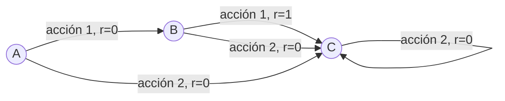

La iteración de política es un método en el aprendizaje por refuerzo **para encontrar la política óptima de un** [[Procesos de Decisión de Markov]]. Este método utiliza la [[Ecuación de Bellman]] para **iterativamente** actualizar los valores de los estados y la política **hasta que la política converge a la política óptima**.

El algoritmo de iteración de política se compone de dos pasos principales que se repiten hasta que la política no cambia entre iteraciones:

1. **Evaluación de la Política**: Dada una política $\pi$, la evaluación de la política calcula la [[Función de valor de estado (V)]] $V^\pi$ para esa política. **Esto se hace resolviendo la ecuación de Bellman para la función de valor de estado.** En la práctica, esto se hace a menudo a través de una serie de actualizaciones iterativas de los valores de los estados.

2. **Mejora de la Política**: Dada la función de valor de estado calculada en el paso de evaluación de la política, la mejora de la política actualiza la política seleccionando, para cada estado, la acción que maximiza la suma de la recompensa inmediata y el valor del estado sucesor. Esto se hace utilizando la ecuación de Bellman óptima (vease [[Ecuación de Bellman#Ecuación de Bellman óptima]]).

En resumen, el algoritmo de iteración de política comienza con una política inicial (que puede ser aleatoria), luego alterna entre la evaluación de la política y la mejora de la política hasta que la política converge.

# Algoritmo 

![[Pasted image 20230624121042.png]]

> Una seria desventaja de Policy Iteration es que hacer una evaluacion completa de $π_k$ en cada paso demora mucho tiempo.

### Ejemplo Sencillo

Consideremos un MDP muy simple con tres estados (A, B y C) y dos posibles acciones en cada estado (1 y 2). Supongamos que las recompensas son 0 para todas las transiciones excepto para la acción 1 en el estado B, que tiene una recompensa de 1. Supongamos además que todas las acciones llevan al agente al estado C, excepto la acción 1 en el estado A, que lleva al agente al estado B.

Realicemos una iteración de política para este MDP. Empezaremos con una política aleatoria donde el agente elige cada acción con igual probabilidad (0.5) en cada estado.

Primero, necesitamos inicializar la función de valor de estado $V(s)$ para cada estado. Podemos comenzar con cero para cada estado.

- $V(A) = 0$
- $V(B) = 0$
- $V(C) = 0$

Luego, repetimos los siguientes pasos hasta que la política no cambie entre iteraciones:

1. **Evaluación de la Política:** Resolvemos la ecuación de Bellman para la función de valor de estado con la política actual.

2. **Mejora de la Política:** Actualizamos la política seleccionando la acción que maximiza la suma de la recompensa inmediata y el valor del estado sucesor en cada estado.

Supongamos que el factor de descuento $\gamma$ es 1 para simplificar los cálculos.

Primero, evaluamos la política actual:
- $V(A) = 0.5 * [0 + V(B)] + 0.5 * [0 + V(C)] = 0$
- $V(B) = 0.5 * [1 + V(C)] + 0.5 * [0 + V(C)] = 0.5$
- $V(C) = 0.5 * [0 + V(C)] + 0.5 * [0 + V(C)] = 0$

Luego, mejoramos la política actual. Para cada estado, seleccionamos la acción que maximiza la suma de la recompensa inmediata y el valor del estado sucesor:

- En el estado A, la acción 1 lleva al estado B con una recompensa de 0 y la acción 2 lleva al estado C también con una recompensa de 0. Sin embargo, dado que $V(B) > V(C)$, seleccionamos la acción 1.

- En el estado B, la acción 1 lleva al estado C con una recompensa de 1 y la acción 2 lleva al estado C con una recompensa de 0. Así que seleccionamos la acción 1.

- En el estado C, ambas acciones mantienen al agente en el estado C con una recompensa de 0. Así que podemos seleccionar cualquier acción.

Por lo tanto, la política mejorada sería:
- $\pi(A) = \{1: 1, 2: 0\}$
- $\pi(B) = \{1: 1, 2: 0\}$
- $\pi(C) = \{1: 0.5, 2: 0.5\}$

Repetiríamos este proceso hasta que la política no cambie entre iteraciones. En este caso, la política ya no cambiará en las iteraciones siguientes, por lo que hemos encontrado la política óptima.

<iframe width="560" height="315" src="https://www.youtube.com/embed/_j6pvGEchWU" title="YouTube video player" frameborder="0" allow="accelerometer; autoplay; clipboard-write; encrypted-media; gyroscope; picture-in-picture; web-share" allowfullscreen></iframe>