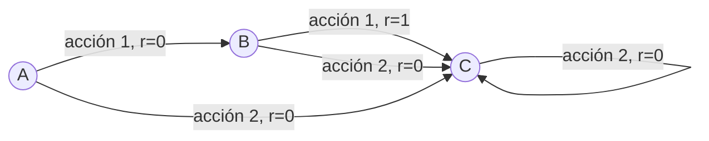

La iteración de política es un método en el aprendizaje por refuerzo **para encontrar la política óptima de un** [[Procesos de Decisión de Markov]]. Este método utiliza la [[Ecuación de Bellman]] para **iterativamente** actualizar los valores de los estados y la política **hasta que la política converge a la política óptima**.

El algoritmo de iteración de política se compone de dos pasos principales que se repiten hasta que la política no cambia entre iteraciones:

1. **Evaluación de la Política**: Dada una política $\pi$, la evaluación de la política calcula la [[Función de valor de estado (V)]] $V^\pi$ para esa política. **Esto se hace resolviendo la ecuación de Bellman para la función de valor de estado.** En la práctica, esto se hace a menudo a través de una serie de actualizaciones iterativas de los valores de los estados.

2. **Mejora de la Política**: Dada la función de valor de estado calculada en el paso de evaluación de la política, la mejora de la política actualiza la política seleccionando, para cada estado, la acción que maximiza la suma de la recompensa inmediata y el valor del estado sucesor. Esto se hace utilizando la ecuación de Bellman óptima (vease [[Ecuación de Bellman#Ecuación de Bellman óptima]]).

En resumen, el algoritmo de iteración de política comienza con una política inicial (que puede ser aleatoria), luego alterna entre la evaluación de la política y la mejora de la política hasta que la política converge.

# Algoritmo 

![[Pasted image 20230624121042.png]]

### Ejemplo Sencillo

Consideremos un MDP muy simple con tres estados (A, B y C) y dos posibles acciones en cada estado (1 y 2). Supongamos que las recompensas son 0 para todas las transiciones excepto para la acción 1 en el estado B, que tiene una recompensa de 1. Supongamos además que todas las acciones llevan al agente al estado C, excepto la acción 1 en el estado A, que lleva al agente al estado B.

Inicialmente, podríamos comenzar con una política aleatoria, donde el agente elige entre las dos acciones con igual probabilidad en cada estado.

En la fase de evaluación de la política, calcularíamos la función de valor de estado para esta política. Esto podría hacerse, por ejemplo, mediante la iteración de valor, donde se inicia con una función de valor de estado inicial arbitraria y se actualiza iterativamente la función de valor de estado utilizando la ecuación de Bellman hasta que converja.

Una vez que tenemos la función de valor de estado para la política actual, podemos pasar a la fase de mejora de la política. En cada estado, seleccionaríamos la acción que maximiza la suma de la recompensa inmediata y el valor del estado sucesor.

Repetiríamos este proceso hasta que la política no cambie entre iteraciones. La política resultante sería la política óptima para este MDP.
