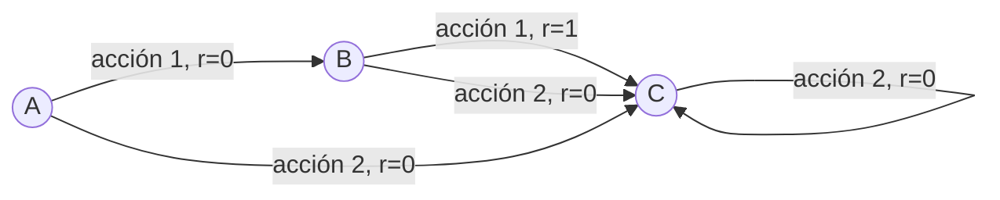

La iteración de valor es otro método en el aprendizaje por refuerzo para encontrar la [[Política optima]] de un [[Procesos de Decisión de Markov]]. A diferencia de la [[Iteración de Política (policy iteration)]], que alterna entre la evaluación de la política y la mejora de la política, la **iteración de valor combina estos dos pasos en uno solo**.

El algoritmo de iteración de valor sigue los siguientes pasos:

1. **Inicialización**: Se inicia con una [[Función de valor de estado (V)]] arbitraria y una política arbitraria.

2. **Actualización de la Función de Valor**: En cada iteración, para cada estado, se actualiza la función de valor de estado utilizando la ecuación de Bellman. Específicamente, se calcula el valor máximo posible que se puede obtener al seleccionar la mejor acción posible dada la política actual.

3. **Convergencia**: Este proceso se repite hasta que la función de valor de estado deje de cambiar significativamente (o, en la práctica, cambie menos que un pequeño umbral predeterminado). 

4. **Extracción de la Política**: Una vez que la función de valor de estado ha convergido, se extrae la política óptima seleccionando, para cada estado, la acción que maximiza la suma de la recompensa inmediata y el valor del estado sucesor.

La belleza de la iteración de valor radica en su simplicidad y eficiencia. Al combinar la evaluación de la política y la mejora de la política en un solo paso, evita la necesidad de resolver completamente la ecuación de Bellman en cada iteración, lo que puede ser costoso computacionalmente.

**A pesar de su eficiencia, la iteración de valor tiene una desventaja importante: no garantiza que la política mejore en cada paso, por lo que puede llevar más tiempo que la iteración de política para converger a la política óptima en algunos casos**.

Además, como todos los métodos de programación dinámica, la iteración de valor puede ser impracticable para MDPs con un gran número de estados o acciones debido al problema de la "maldición de la dimensionalidad". En estos casos, se pueden utilizar métodos de aprendizaje por refuerzo basados en aproximación de funciones, como el Q-learning o los métodos de Aprendizaje Profundo por Refuerzo (DRL).

# Algoritmo 

![[Pasted image 20230624131011.png]]

### Ejemplo Sencillo

Consideremos un MDP muy simple con tres estados (A, B y C) y dos posibles acciones en cada estado (1 y 2). Supongamos que las recompensas son 0 para todas las transiciones excepto para la acción 1 en el estado B, que tiene una recompensa de 1. Supongamos además que todas las acciones llevan al agente al estado C, excepto la acción 1 en el estado A, que lleva al agente al estado B.

Sí, absolutamente. Realicemos una iteración de valor para el mismo MDP. Empezaremos con una función de valor de estado inicial donde el valor de cada estado es 0.

- $V(A) = 0$
- $V(B) = 0$
- $V(C) = 0$

Luego, repetimos los siguientes pasos hasta que la función de valor de estado deje de cambiar significativamente:

1. **Actualización de la Función de Valor**: Para cada estado, actualizamos la función de valor de estado utilizando la ecuación de Bellman. Específicamente, calculamos el valor máximo posible que se puede obtener al seleccionar la mejor acción posible.

2. **Convergencia**: Este proceso se repite hasta que la función de valor de estado deje de cambiar significativamente (o, en la práctica, cambie menos que un pequeño umbral predeterminado).

Supongamos que el factor de descuento $\gamma$ es 1 para simplificar los cálculos.

- $V(A) = max\{0 + V(B), 0 + V(C)\} = max\{0, 0\} = 0$
- $V(B) = max\{1 + V(C), 0 + V(C)\} = max\{1, 0\} = 1$
- $V(C) = max\{0 + V(C), 0 + V(C)\} = max\{0, 0\} = 0$
