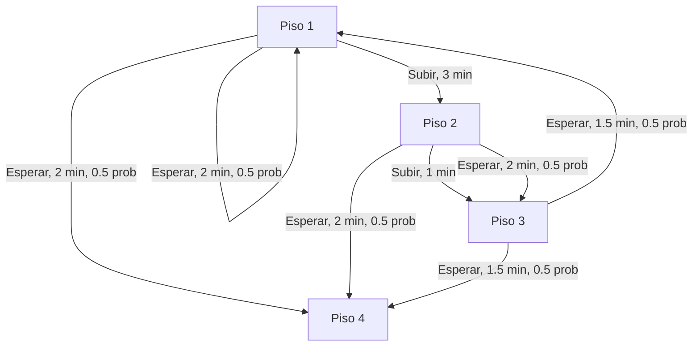

# Modele el problema con un grafo con transiciones de probabilidad

> El piso 4 se considera una estado terminal

# Cálculos analíticos

> Nota: Se considera (gamma) $\gamma$ = 1 para todos los ejercicios

## Calcule la utilidad esperada de la política “siempre esperar"

$$\large v_\pi(1) = 0.5[-2 + 1 \times v_\pi(1) + 0.5[-2 + 1 \times v_\pi(4)] $$
