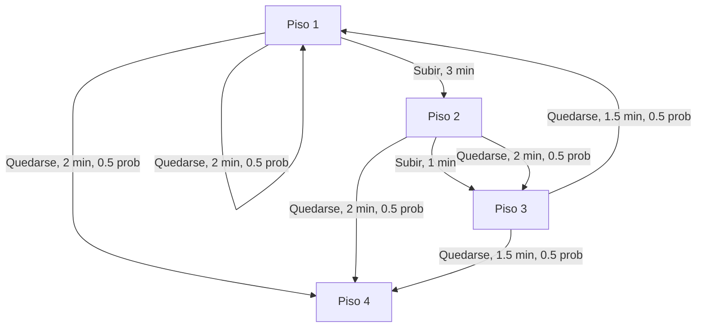

# Modele el problema con un grafo con transiciones de probabilidad

```mermaid
graph TD
    A[Piso 1] -->|Subir, 3 min| B[Piso 2]
    A -->|Quedarse, 2 min, 0.5 prob| A
    A -->|Quedarse, 2 min, 0.5 prob| D[Piso 4]
    B -->|Subir, 1 min| C[Piso 3]
    B -->|Quedarse, 2 min, 0.5 prob| C
    B -->|Quedarse, 2 min, 0.5 prob| D
    C -->|Quedarse, 1.5 min, 0.5 prob| A
    C -->|Quedarse, 1.5 min, 0.5 prob| D
```

# Cálculos analíticos

## Calcule la utilidad esperada de la política “siempre esperar"

