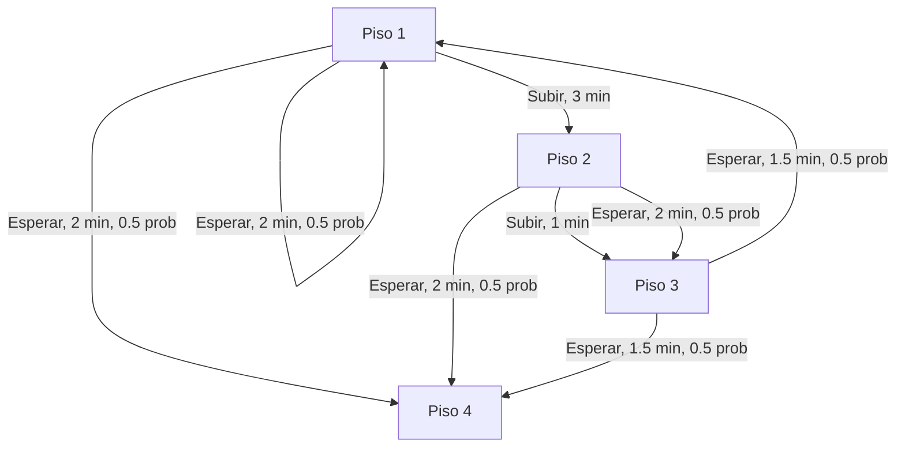

# Modele el problema con un grafo con transiciones de probabilidad

> El piso 4 se considera una estado terminal

# Cálculos analíticos

> Nota: Se considera (gamma) $\gamma$ = 1 para todos los ejercicios

Para resolver los siguiente problemas se utiliza la función de Bellman
$$\Large
v_\pi(s) = \sum_{a} \pi(a|s) \sum_{s', r} p(s', r | s, a) \left[ r + \gamma \cdot E_\pi[G_{t+1} | S_{t+1} = s'] \right]
$$

## Política “siempre esperar"

Aplicando la función de Bellman calculamos el valor de cada estado. Hay que tener en cuenta de que 1) nuestra politica 
$$\large v_\pi(1) = 0.5[-2 + 1 \times v_\pi(1)] + 0.5[-2 + 1 \times v_\pi(4)] $$
$$\large
v_\pi(2) = 0.5[-2 + 1 \times v_\pi(3)] + 0.5[-2 + 1 \times v_\pi(4)]
$$
$$\large
v_\pi(3) = 0.5[-2.5 + 1 \times v_\pi(1)] + 0.5[-1.5 + 1 \times v_\pi(4)]
$$
$$\large
v_\pi(4) = 0
$$
> $v_\pi(4) = 0$ ya que es estado final 