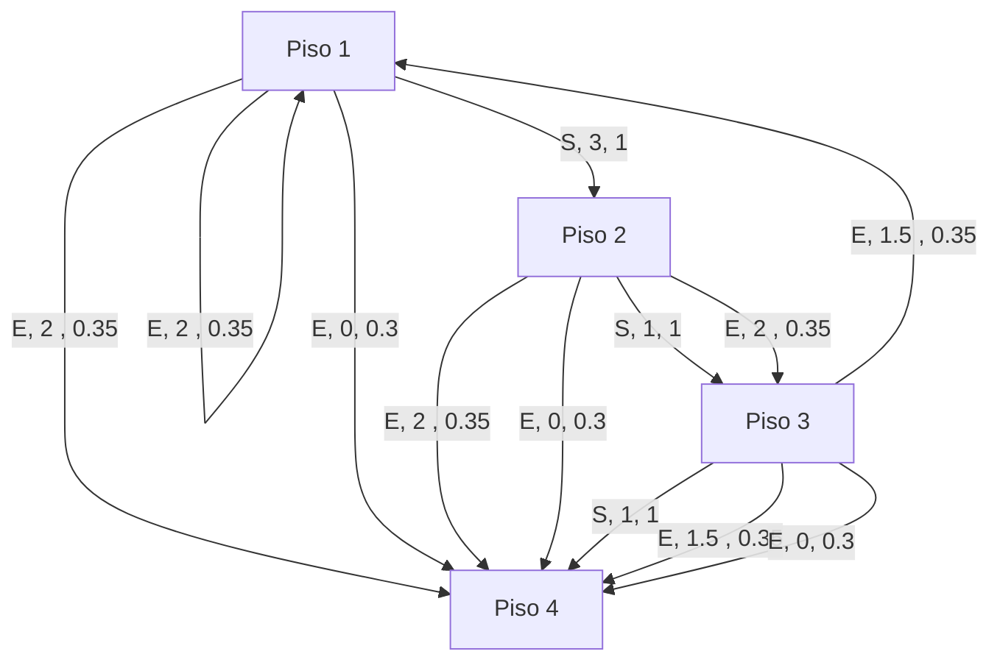

# 1 - Modele el problema con un grafo con transiciones de probabilidad

> El piso 4 se considera una estado terminal
> E = Esperar
> S = Subir

# 2 - Cálculos analíticos

> Nota: Se considera (gamma) $\gamma$ = 1 para todos los ejercicios

Para resolver los siguiente problemas se utiliza la función de Bellman
$$\Large
v_\pi(s) = \sum_{a} \pi(a|s) \sum_{s', r} p(s', r | s, a) \left[ r + \gamma \cdot E_\pi[G_{t+1} | S_{t+1} = s'] \right]
$$

## a - Política “siempre esperar"

Aplicando la función de Bellman calculamos el valor de cada estado. Hay que tener en cuenta de que 1) nuestra política es determinista (siempre esperar) 2) tenemos $\gamma$ = 1
$$\large v_\pi(1) = 0.5[-2 + 1 \times v_\pi(1)] + 0.5[-2 + 1 \times v_\pi(4)] $$
$$\large
v_\pi(2) = 0.5[-2 + 1 \times v_\pi(3)] + 0.5[-2 + 1 \times v_\pi(4)]
$$
$$\large
v_\pi(3) = 0.5[-2.5 + 1 \times v_\pi(1)] + 0.5[-1.5 + 1 \times v_\pi(4)]
$$
$$\large
v_\pi(4) = 0
$$
> $v_\pi(4) = 0$ ya que es estado final

Luego de despejar nos queda:
$$\large 
v_\pi(1) = -4 
$$
$$\large 
v_\pi(2) = -4 
$$
$$\large 
v_\pi(3) = -4 
$$
$$\large 
v_\pi(4) = 0 
$$

## b - Política “siempre subir"

$$\large
v_\pi(1) = 1[-3 + 1 \times v_\pi(2)] 
$$
$$\large
v_\pi(2) = 1[-1 + 1 \times v_\pi(3)]
$$
$$\large
v_\pi(3) = 1[-1 + 1 \times v_\pi(4)]
$$
$$\large
v_\pi(4) = 0
$$
Luego de despejar nos queda:

$$\large
v_\pi(1) = -5
$$
$$\large
v_\pi(2) = -2
$$
$$\large
v_\pi(3) = -1
$$
$$\large
v_\pi(4) = 0
$$

## c - Política “siempre esperar" con modificaciones

El modelo cambia ya que ahora "la probabilidad de llegar mágicamente al piso 4 por esperar en los descansos es de 0.3".

> Se asume que las posibilidades 0.5 del anterior modelo pasan a 0.35.
> También se asume que la nueva posibilidad de llegar al piso 4 no tiene peso/costo alguno

$$\large
v_\pi(1) = 1 \cdot \left[ 0.35 \cdot (2 + v_\pi(1)) + 0.35 \cdot (2 + v_\pi(4)) + 0.3 \cdot (0 + v_\pi(4)) \right]
$$

$$\large
v_\pi(1) = 1 \cdot \left[ 0.35 \cdot (2 + v_\pi(1)) + 0.35 \cdot (2 + v_\pi(4)) + 0.3 \cdot (0 + v_\pi(4)) \right]
$$
$$\large
v_\pi(3) = 1 \cdot \left[ 0.35 \cdot (1.5 + v_\pi(1)) + 0.35 \cdot (1.5 + v_\pi(4)) + 0.3 \cdot (0 + v_\pi(4)) \right]
$$
$$\large
v_\pi(4) = 0
$$

