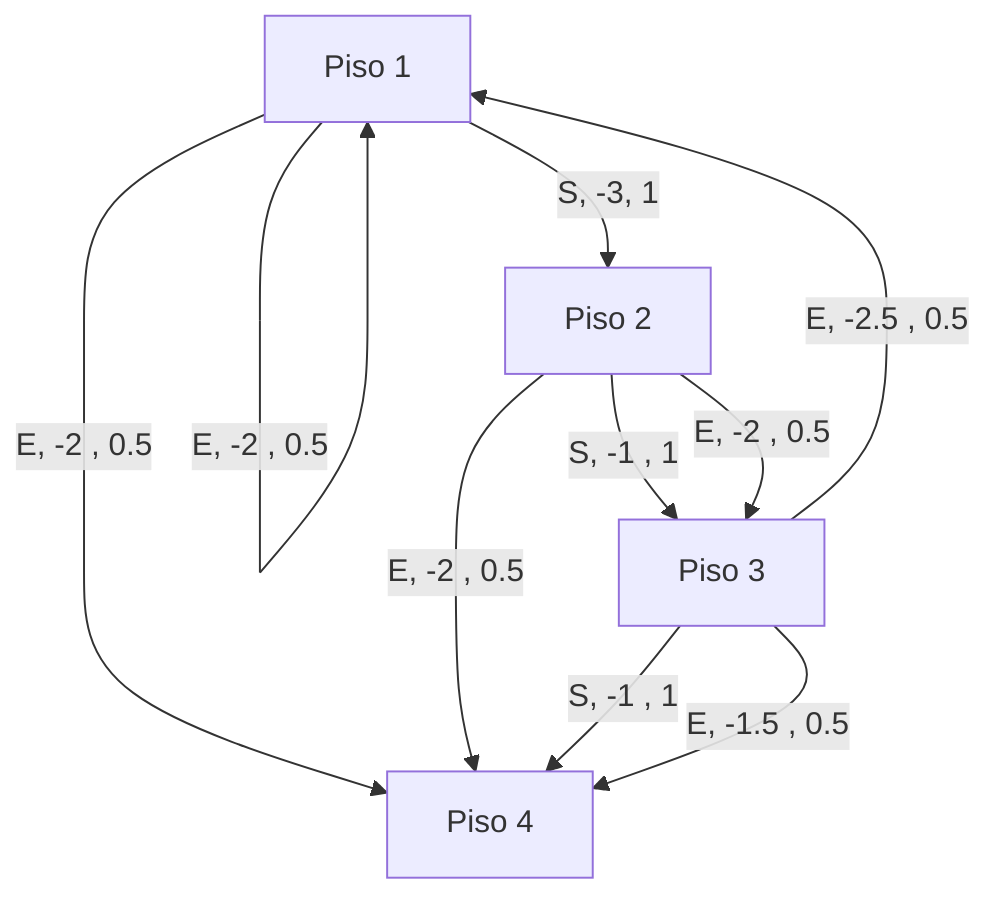
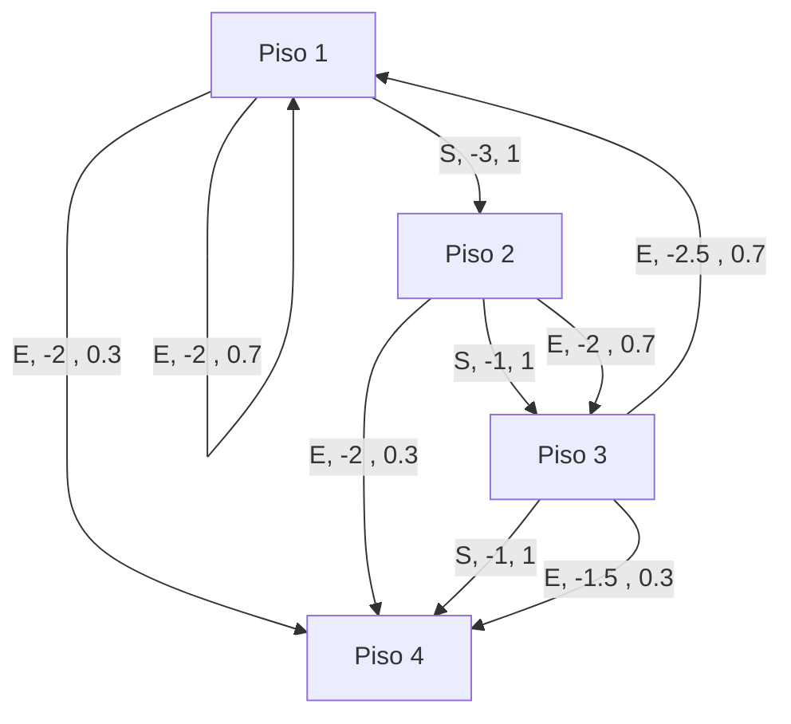

# 1) Modele el problema con un grafo con transiciones de probabilidad

> El piso 4 se considera una estado terminal
> E = Esperar
> S = Subir

# 2) Cálculos analíticos

> Nota: Se considera (gamma) $\gamma$ = 1 para todos los ejercicios

Para resolver los siguiente problemas se utiliza la función de Bellman
$$\Large
v_\pi(s) = \sum_{a} \pi(a|s) \sum_{s', r} p(s', r | s, a) \left[ r + \gamma \cdot E_\pi[G_{t+1} | S_{t+1} = s'] \right]
$$

## a) Política “siempre esperar"

Aplicando la función de Bellman calculamos el valor de cada estado. Hay que tener en cuenta de que 1) nuestra política es determinista (siempre esperar) 2) tenemos $\gamma$ = 1
$$\large v_\pi(1) = 0.5[-2 + 1 \times v_\pi(1)] + 0.5[-2 + 1 \times v_\pi(4)] $$
$$\large
v_\pi(2) = 0.5[-2 + 1 \times v_\pi(3)] + 0.5[-2 + 1 \times v_\pi(4)]
$$
$$\large
v_\pi(3) = 0.5[-2.5 + 1 \times v_\pi(1)] + 0.5[-1.5 + 1 \times v_\pi(4)]
$$
$$\large
v_\pi(4) = 0
$$
> $v_\pi(4) = 0$ ya que es estado final

Luego de despejar nos queda:
$$\large 
v_\pi(1) = -4 
$$
$$\large 
v_\pi(2) = -4 
$$
$$\large 
v_\pi(3) = -4 
$$
$$\large 
v_\pi(4) = 0 
$$

## b) Política “siempre subir"

$$\large
v_\pi(1) = 1[-3 + 1 \times v_\pi(2)] 
$$
$$\large
v_\pi(2) = 1[-1 + 1 \times v_\pi(3)]
$$
$$\large
v_\pi(3) = 1[-1 + 1 \times v_\pi(4)]
$$
$$\large
v_\pi(4) = 0
$$
Luego de despejar nos queda:

$$\large
v_\pi(1) = -5
$$
$$\large
v_\pi(2) = -2
$$
$$\large
v_\pi(3) = -1
$$
$$\large
v_\pi(4) = 0
$$

## c) Política “siempre esperar" con modificaciones

El modelo cambia ya que ahora "la probabilidad de llegar mágicamente al piso 4 por esperar en los descansos es de 0.3".

$$\large
v_\pi(1) = 0.7 \cdot (-2 + v_\pi(1)) + 0.3 \cdot (-2 + v_\pi(4))
$$
$$\large
v_\pi(2) = 0.7 \cdot (-2 + v_\pi(3)) + 0.3 \cdot (-2 + v_\pi(4))
$$
$$\large
v_\pi(3) = 0.7 \cdot (-2.5 + v_\pi(1)) + 0.3 \cdot (-1.5 + v_\pi(4))
$$
$$\large
v_\pi(4) = 0
$$
Si despejamos

$$\large
v_\pi(1) \approx -6.667
$$
$$\large
v_\pi(2) \approx -6.802
$$
$$\large
v_\pi(3) \approx -6.867
$$
$$\large
v_\pi(4) = 0
$$

# 3) Evaluación y mejora de política

## a) Evaluación política "siempre subir"

### Iteración 0

> Tomamos el valor de la política inicialmente como cero. $v_0(s) = 0$

### Iteración 1

$$
v_1(1) = \mathbb{E}[R_t | S_{t-1} = 1, A_{t-1} = \text{subir}] = -3 + v_0(2) = -3
$$
$$
v_1(2) = \mathbb{E}[R_t | S_{t-1} = 2, A_{t-1} = \text{subir}] = -1 + v_0(3) = -1
$$
$$
v_1(3) = \mathbb{E}[R_t | S_{t-1} = 3, A_{t-1} = \text{subir}] = -1 + v_0(4) = -1
$$
$$
v_1(4) = 0
$$
### Iteración 2

$$
v_2(1) = \mathbb{E}[R_t | S_{t-1} = 1, A_{t-1} = \text{subir}] = -3 + v_1(2) = -3 - 1 = -4
$$
$$
v_2(2) = \mathbb{E}[R_t | S_{t-1} = 2, A_{t-1} = \text{subir}] = -1 + v_1(3) = -1 - 1 = -2
$$
$$
v_2(3) = \mathbb{E}[R_t | S_{t-1} = 3, A_{t-1} = \text{subir}] = -1 - v_1(4) = -1 - 0 = -1
$$
$$
v_2(4) = 0
$$
### Iteración 3

$$
v_3(1) = \mathbb{E}[R_t | S_{t-1} = 1, A_{t-1} = \text{subir}] = -3 + v_2(2) = -3 - 2 = -5
$$
$$
v_3(2) = \mathbb{E}[R_t | S_{t-1} = 2, A_{t-1} = \text{subir}] = -1 - v_2(3) = -1 - 1 = -2
$$
$$
v_3(3) = \mathbb{E}[R_t | S_{t-1} = 3, A_{t-1} = \text{subir}] = -1 - v_2(4) = -1 + 0 = -1
$$
$$
v_3(4) = 0
$$
> Coincide con nuestro calculo en el punto 2-b

## b) Mejora de política (una iteración)

$$
q_{\pi}(1, \text{subir}) = 1 \left[-3 + \gamma v_\pi(2)\right]
$$
$$
q_{\pi}(1, \text{subir}) = -5
$$
$$
q_{\pi}(1, \text{esperar}) = 0.5 \left[-2 + \gamma v_\pi(1)\right] + 0.5 \left[-2 + \gamma v_\pi(4)\right]
$$
$$
q_{\pi}(1, \text{esperar}) = -4.5
$$
***
$$
q_{\pi}(2, \text{subir}) = 1 \left[-1 + \gamma v_\pi(3)\right]
$$
$$
q_{\pi}(2, \text{subir}) = -2
$$
$$
q_{\pi}(2, \text{esperar}) = 0.5 \left[-2 + \gamma v_\pi(2)\right] + 0.5 \left[-2 + \gamma v_\pi(4)\right]
$$
$$
q_{\pi}(2, \text{esperar}) = -3
$$
***
$$
q_{\pi}(3, \text{subir}) = 1 \left[-1 + \gamma v_\pi(4)\right]
$$
$$
q_{\pi}(3, \text{subir}) = -1
$$
$$
q_{\pi}(3, \text{esperar}) = 0.5 \left[-2.5 + \gamma v_\pi(1)\right] + 0.5 \left[-1.5 + \gamma v_\pi(4)\right]
$$
$$
q_{\pi}(3, \text{esperar}) = -4.5
$$

> Por ende mi nueva política:
> Piso 1: esperar
> Piso 2: subir
> Piso 3: subir

## Evaluamos la nueva política

### Iteración 0

> Tomamos el valor de la política inicialmente como cero. $v_0(s) = 0$

### Iteración 1

$$
\begin{align}
v_1(1) = 0.5[-2 + v_0(1)] + 0.5[-2 + v_0(4)] = -2 \\
v_1(2) = -1 + v_0(3) = -1 \\
v_1(3) = -1 + v_0(4) = -1 \\
v_1(4) = 0
\end{align}
$$

### Iteración 2

$$
\begin{align}
v_2(1) = 0.5[-2 + v_1(1)] + 0.5[-2 + v_1(4)] = -3 \\
v_2(2) = -1 + v_1(3) = -2 \\
v_2(3) = -1 + v_1(4) = -1 \\
v_2(4) = 0
\end{align}
$$

### Iteración 3

# 4) Value Iteration

Para ello trateremos de converjer las siguientes funciones:
$$\large
\begin{aligned}
v_{k+1}(1) &= \max_{a \in \{S, E\}} \left\{ \sum_{s', r} p(s', r | 1, a) (r + \gamma v_k(s')) \right\} \\
&= \max \left\{ -3 + v_k(2), 0.5 \cdot (-2 )  + (-2) \cdot 0.5 \right\}
\end{aligned}
$$
$$\large
\begin{aligned}
v_{k+1}(2) &= \max_{a \in \{S, E\}} \left\{ \sum_{s', r} p(s', r | 2, a) (r + \gamma v_k(s')) \right\} \\
&= \max \left\{ -1 + v_k(3), -2 \cdot 0.5 + (-2) \cdot 0.5 \right\}
\end{aligned}
$$

$$\large
\begin{aligned}
v_{k+1}(3) &= \max_{a \in \{S, E\}} \left\{ \sum_{s', r} p(s', r | 3, a) (r + \gamma v_k(s')) \right\} \\
&= \max \left\{ -1 + v_k(4), -2.5 \cdot 0.5 + (-1.5) \cdot 0.5 \right\}
\end{aligned}
$$
$$\large
v_{k+1}(4) = 0
$$