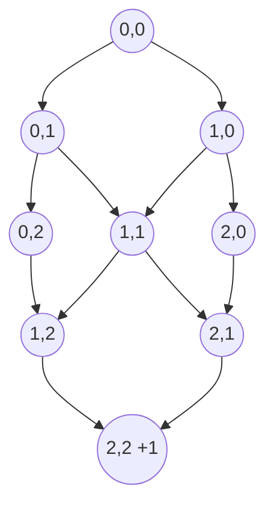
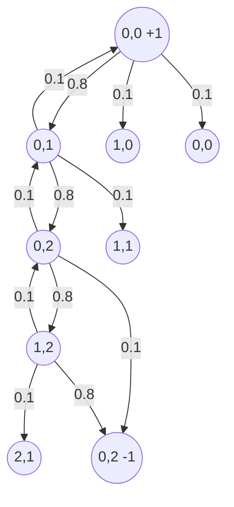

Un Proceso de Decisión de Markov (MDP, por sus siglas en inglés) es un modelo matemático que describe cómo un [[Agente]] toma decisiones en un [[Entorno]]. En términos simples, un MDP es como un juego en el que un jugador (el agente) interactúa con un mundo que cambia y debe tomar decisiones para lograr un objetivo, como ganar puntos o completar una tarea.

El MDP se compone de cuatro elementos principales:

1.  Estados: son las diferentes situaciones o configuraciones en las que puede encontrarse el agente dentro del entorno. Véase [[Estado]]
2.  Acciones: son las posibles decisiones o movimientos que el agente puede realizar en cada estado. Véase [[Acción]]
3.  Transiciones: son las probabilidades de pasar de un estado a otro, dada una acción específica. Véase [[Transición]]
4.  Recompensas: son los puntos o beneficios que el agente recibe al realizar acciones en el entorno. Véase [[Recompensa]]

El agente toma decisiones basándose en su conocimiento actual del entorno y las recompensas asociadas a las acciones. El objetivo del agente es encontrar una política óptima ([[Política optima]]), que es una estrategia para seleccionar acciones en cada estado de manera que maximice el valor total de las recompensas a lo largo del tiempo.

Un aspecto clave de los MDP es que tienen **la propiedad de Markov**, lo que significa que **el estado actual del entorno contiene toda la información necesaria para decidir la acción óptima**, sin importar cómo llegamos a ese estado. En otras palabras, el pasado no importa y sólo necesitamos considerar el estado presente para tomar decisiones.

> [!quote]
> Thus MDPs involve delayed reward and the need to tradeoff immediate and delayed reward.

![[Pasted image 20230408171531.png]]

La notación comúnmente utilizada para representar el conjunto de estados, acciones y recompensas en un problema de aprendizaje por refuerzo es la siguiente:

1.  Estados: El conjunto de todos los posibles estados se denota como $\mathcal{S}$. Cada estado individual dentro de este conjunto se representa como $s$, donde $s \in \mathcal{S}$.

2.  Acciones: El conjunto de todas las posibles acciones se denota como $\mathcal{A}$. Cada acción individual dentro de este conjunto se representa como $a$, donde $a \in \mathcal{A}$.

3.  Recompensas: El conjunto de todas las posibles recompensas se denota como $\mathcal{R}$. Cada recompensa individual dentro de este conjunto se representa como $r$, donde $r \in \mathcal{R}$.
   
> En particular, $\mathcal{R}$ es un conjunto finito de números reales.

En algunos casos, el conjunto de acciones disponibles puede variar según el estado en el que se encuentre el agente. En tales situaciones, se utiliza la notación $\mathcal{A}(s)$ para representar el conjunto de acciones disponibles en el estado $s$.

# Probabilidad condicional
$$\Large p(s', r|s, a) = \text{Pr}({S_t = s', R_t = r | S_{t-1} = s, A_{t-1} = a})$$Representa la probabilidad conjunta de transición y recompensa en un Proceso de Decisión de Markov (MDP). Vamos a desglosar esta notación:

-   $s$: el estado actual en el tiempo $t-1$.
-   $a$: la acción tomada por el agente en el tiempo $t-1$.
-   $s'$: el estado siguiente en el tiempo $t$.
-   $r$: la recompensa recibida al pasar de $s$ a $s'$ tomando la acción $a$.

La expresión $p(s', r|s, a)$ representa la probabilidad de que el agente, estando en el estado $s$ y tomando la acción $a$, llegue al estado siguiente $s'$ y reciba una recompensa $r$. Esta probabilidad se calcula condicionalmente, dadas las variables de estado y acción en el tiempo $t-1$. La notación $\text{Pr}{S_t = s', R_t = r | S_{t-1} = s, A_{t-1} = a}$ es simplemente otra forma de escribir esta [[Probabilidad condicional]].

Esta notación es importante en el estudio de MDP, ya que captura tanto la dinámica del entorno (cómo los estados cambian en función de las acciones tomadas) como la estructura de recompensa (qué recompensas se reciben como resultado de tomar ciertas acciones en ciertos estados). Estos dos aspectos son cruciales para que el agente aprenda a tomar decisiones óptimas y maximizar su recompensa acumulada a lo largo del tiempo.

# Normalización

La expresión que has proporcionado es un requisito de normalización para las probabilidades de transición y recompensa en un Proceso de Decisión de Markov (MDP). La expresión establece que la suma de todas las probabilidades de transición y recompensa para cada estado y recompensa posibles debe ser igual a 1. A continuación, desgloso la expresión:

$$\Large\sum_{s' \in \mathcal{S}}\sum_{r \in \mathcal{R}}p(s', r|s, a) = 1$$
-   $\sum_{s' \in \mathcal{S}}$: esta es una suma sobre todos los estados posibles $s'$. Estamos sumando las probabilidades para cada estado siguiente $s'$.
-   $\sum_{r \in \mathcal{R}}$: esta es una suma sobre todas las recompensas posibles $r$. Estamos sumando las probabilidades para cada recompensa $r$.
-   $p(s', r|s, a)$: esto representa la probabilidad conjunta de transición y recompensa de estar en el estado $s$, tomar la acción $a$, llegar al estado siguiente $s'$ y recibir una recompensa $r$.

La expresión completa garantiza que las probabilidades de todas las combinaciones posibles de estados siguientes y recompensas sumen 1, dada una combinación específica de estado actual y acción. **Esta es una condición necesaria para que las probabilidades sean válidas y bien definidas en un MDP**.

# Otras probabilidades

## Probabilidades de transición de estados

Estas probabilidades describen cómo el entorno cambia de un estado a otro dada una acción específica. Se denotan como $p(s'|s, a)$, que representa la probabilidad de pasar del estado $s$ al estado $s'$ al realizar la acción $a$. Estas probabilidades son fundamentales en el MDP, ya que caracterizan la dinámica del entorno y cómo este responde a las acciones del agente.
$$\Large p(s'|s, a) = \text{Pr}({S_t = s' | S_{t-1} = s, A_{t-1} = a}) = \sum_{r \in \mathcal{R}}p(s', r|s, a)$$
> Básicamente, que probabilidad tengo que estando en el estado $s$ y haciendo la acción $a$ termine en $s'$

> [!question]
> **¿Que pasa si las transiciones son determinısticas?**
> En un problema determinístico, cada acción en un estado particular siempre llevará al agente al mismo estado siguiente. No hay incertidumbre en la transición. En este caso, las probabilidades de transición se vuelven 1 para el estado siguiente y 0 para todos los demás estados. La notación para esto sería:
> $$ p(s' | s, a) = \begin{cases} 1, & \text{si } s' \text{ es el estado siguiente determinado por } (s, a) \\ 0, & \text{en cualquier otro caso} \end{cases} $$

## Recompensas esperadas para pares estado-acción

Las recompensas esperadas para los pares estado-acción se denotan como 
$$\Large r(s, a) = \mathbb{E}[R_t | S_{t-1} = s, A_{t-1} = a] = \sum_{r \in \mathcal{R}}r\sum_{s' \in \mathcal{S}}p(s', r|s, a)$$Esta expresión representa la recompensa promedio que se espera recibir cuando se toma la acción $a$ estando en el estado $s$. Estos valores ayudan al agente a determinar qué acciones son preferibles en un estado dado para maximizar las recompensas a lo largo del tiempo.

> [!question]
> **¿Que pasa si las transiciones son determinısticas?**
> En un problema determinístico, la recompensa para un par estado-acción específico es siempre la misma, ya que no hay incertidumbre en la recompensa. Esto significa que la recompensa esperada para un par estado-acción es simplemente la recompensa fija asociada con ese par. La notación para esto sería:
> $$
r(s, a) = r_{fija}(s, a)
$$

# Episodios

Un episodio es una secuencia finita de interacciones entre un agente y su entorno. Un episodio comienza en un estado inicial y termina cuando el agente alcanza un estado terminal o se cumple cierta condición, como alcanzar un límite de tiempo o un número máximo de pasos. Los problemas de aprendizaje por refuerzo se pueden categorizar en dos tipos: episódicos y continuos. En los problemas episódicos, las interacciones ocurren en episodios **separados** y **discretos**, mientras que en los problemas **continuos**, las interacciones no tienen un punto final claro y pueden extenderse indefinidamente. vease [[Episodio]]

# Retorno

El [[Retorno]] es una medida del **valor acumulado** de las recompensas que un agente recibe durante un **episodio**. El objetivo del agente en el aprendizaje por refuerzo es maximizar este retorno. En muchos casos, se utiliza un **factor de descuento**, denotado como $\gamma$, para darle más peso a las recompensas inmediatas en comparación con las recompensas futuras. El retorno en el tiempo $t$, denotado como $G_t$, se calcula como:

$$ \Large
G_t = R_{t+1} + \gamma R_{t+2} + \gamma^2 R_{t+3} + \cdots = \sum_{k=0}^{\infty} \gamma^k R_{t+k+1}
$$
## En problemas continuos

En problemas continuos de aprendizaje por refuerzo, las interacciones entre el agente y el entorno no se dividen en episodios separados y discretos, sino que se extienden indefinidamente en el tiempo. En tales casos, el concepto de retorno también se aplica, pero se debe tener cuidado al elegir el factor de descuento $\gamma$.

El retorno en el tiempo $t$ en un problema continuo se calcula de manera similar al caso episódico:
$$\Large
G_t = R_{t+1} + \gamma R_{t+2} + \gamma^2 R_{t+3} + \cdots = \sum_{k=0}^{\infty} \gamma^k R_{t+k+1}
$$
> En problemas continuos, el uso de un factor de descuento $\gamma < 1$ es importante para garantizar la convergencia de la suma infinita.

# Factor de descuento

El factor de descuento $\gamma$ (gamma) es un número entre 0 y 1. Si $\gamma = 0$, el agente solo considera las recompensas inmediatas y no tiene en cuenta las recompensas futuras. Si $\gamma = 1$, el agente considera todas las recompensas futuras por igual y busca maximizar el retorno total a lo largo del tiempo. **Valores intermedios de $\gamma$ permiten al agente equilibrar la importancia de las recompensas inmediatas y futuras.**

> Si $\gamma = 0$, el agente es **miope**: sólo le importa maximizar las recompensas inmediatas.

# Ejemplos

## No estocástico (determinista)

Considera el siguiente ejemplo de un juego de cuadrícula. Un agente está en una cuadrícula de 3x3 y puede moverse en las cuatro direcciones: arriba, abajo, izquierda y derecha. A diferencia del ejemplo estocástico en este caso no hay incertidumbre en los movimientos del agente: si el agente decide moverse a la derecha, entonces definitivamente se moverá a la derecha. El objetivo del agente es moverse desde la esquina superior izquierda de la cuadrícula (estado (0,0)) a la esquina inferior derecha (estado (2,2)) en la menor cantidad de pasos posible. Recibe una recompensa de +1 cuando llega al estado objetivo y una recompensa de -1 por cada paso que da. Este es un ejemplo de un MDP determinista porque el próximo estado y la recompensa dependen completamente del estado actual y de la acción del agente sin ningún factor de aleatoriedad.

## Estocástico (no determinista)
 
Considera el siguiente ejemplo de un juego simplificado. Un agente se encuentra en una cuadrícula de 3x3, donde cada celda es un estado. El agente puede moverse en las cuatro direcciones: arriba, abajo, izquierda y derecha. Sin embargo, hay un factor estocástico: para cualquier movimiento que el agente intente hacer, hay una probabilidad del 80% de que tenga éxito y una probabilidad del 20% de que el agente se mueva en una dirección perpendicular al movimiento intentado (distribuido de manera uniforme entre las dos direcciones perpendiculares). Si el movimiento intentado llevaría al agente fuera de la cuadrícula, entonces el agente permanece en su ubicación actual.

En una esquina de la cuadrícula (digamos, el estado (0,0)), hay una recompensa de +1, y en la esquina opuesta (estado (2,2)), hay una recompensa de -1. En todos los demás estados, la recompensa es 0. El juego termina cuando el agente llega a uno de los estados de recompensa.

Este es un ejemplo de MDP porque el próximo estado y la recompensa dependen solo del estado actual y de la acción tomada por el agente, pero hay un factor de aleatoriedad debido a la posibilidad de que el movimiento del agente no tenga éxito.

Aquí está la representación de este MDP:

# Políticas en MDP

Una [[Política]], denotada comúnmente por $\pi$, es una regla que le dice al agente qué acción tomar en cada estado. En otras palabras, una política es un mapeo de los estados a las probabilidades de seleccionar cada posible acción. Si el agente está siguiendo la política $\pi$ en el momento $t$, entonces $\pi(a|s)$ es la probabilidad de que $A_t=a$ si $S_t=s$.

En términos más sencillos, la política es como el "plan de acción" del agente. Una política podría ser tan simple como "siempre elige la misma acción" o tan compleja como "elige la acción que maximiza la suma esperada de las futuras recompensas, teniendo en cuenta las acciones anteriores y las recompensas recibidas".

### Funciones de Valor en MDP

Una función de valor es una predicción del futuro valor esperado (recompensa a largo plazo) que se puede obtener desde un estado o desde una pareja estado-acción, bajo una política específica. 

Existen dos tipos principales de funciones de valor:

1. **Función de valor de estado $V^\pi(s)$**: Es la recompensa total esperada comenzando en el estado $s$, y luego siguiendo la política $\pi$.  vease [[Función de valor de estado (V)]]

2. **Función de valor de acción $Q^\pi(s, a)$**: Es la recompensa total esperada tomando la acción $a$ en el estado $s$, y luego siguiendo la política $\pi$. vease [[Función de valor de acción (Q)]]

Formalmente, estas funciones se definen como:

$$
V^\pi(s) = E_\pi \left[G_t | S_t = s \right] 
$$
$$
Q^\pi(s, a) = E_\pi \left[G_t | S_t = s, A_t = a \right]
$$

donde $E_\pi$ es la expectativa matemática bajo la política $\pi$ y $G_t$ es el retorno. 

En el aprendizaje por refuerzo, las funciones de valor se utilizan para medir cuán bueno es un estado o una acción en términos de la cantidad de recompensa que el agente puede esperar obtener en el futuro.

> De la defincion de estas funciones sale la [[Ecuación de Bellman]]

## Política optima

El Aprendizaje Reforzado tiene distintos métodos para estimar v∗ y q∗, de modo de usar esas estimaciones para encontrar buenas políticas. 

Si conocemos la función p(s' , r | s, a), podremos usar métodos basados en un modelo (model-based); ej.: [[Programación dinámica]]. 

Si no conocemos p(s' , r | s, a), deberemos usar métodos sin modelo (model-free); ej.: [[Métodos Monte Carlo]] y [[Métodos de Diferencias temporales]].

# Clasificaciones de algoritmos

### 1. Tabulares y Aproximados

Los métodos tabulares de aprendizaje por refuerzo son aquellos que asumen que se dispone de una tabla completa que mapea cada posible par estado-acción a su valor asociado. Esto significa que se requiere que el agente visite cada estado y cada acción varias veces para aprender el valor exacto de cada par estado-acción.

> Los algoritmos que utilizan un enfoque tabular incluyen [[Q-learning]] y [[SARSA]] cuando se aplican a problemas con un espacio de estados y/o acciones discretos y suficientemente pequeños.

Por otro lado, los métodos aproximados se usan cuando el espacio de estados y/o acciones es demasiado grande para manejar de manera tabular. En estos casos, se utiliza una función de aproximación para estimar los valores de estado-acción. Esta función puede ser lineal o no lineal, y se ajusta a medida que el agente explora el espacio de estados-acciones.

> Los métodos que utilizan una aproximación funcional incluyen [[Deep Q-Network (DQN)]], donde se utiliza una red neuronal para aproximar la función Q, y los [[Métodos de Aproximación de Función de Valor]]

### 2. Model-Free y Model-Based

Los métodos de aprendizaje por refuerzo model-free no asumen ninguna información previa sobre el entorno. Estos métodos aprenden directamente de la experiencia del agente, lo cual los hace más flexibles pero generalmente más lentos para converger.

> Los métodos model-free incluyen algoritmos como [[Q-learning]], [[SARSA]], [[Actor-Critic]]

En contraste, los métodos model-based utilizan un modelo del entorno para planificar y mejorar la política del agente. Este modelo puede ser aprendido por el agente o ser proporcionado por el diseñador. Los métodos model-based pueden ser más eficientes que los model-free, pero requieren un modelo exacto o al menos aproximado del entorno.

> Los algoritmos model-based incluyen el [[Iteración de Valor (value iteration)]], el [[Iteración de Política (policy iteration)]], y los [[Métodos de Planificación (planning)]].

### 3. Value-Based y Policy-Based

Los métodos value-based se centran en aprender el valor de cada estado o par estado-acción y derivar la política óptima a partir de estos valores.

> Los algoritmos value-based incluyen [[Q-learning]], [[Iteración de Valor (value iteration)]] y [[SARSA]].

Por otro lado, los métodos policy-based buscan directamente la política óptima sin necesidad de aprender primero los valores de los estados o pares estado-acción. Estos métodos pueden ser más efectivos en espacios de acciones continuas o cuando la política tiene una forma más simple que la función de valor.

> Los algoritmos policy-based incluyen el [[Gradiente de Política]] y [[Actor-Critic]]

### 4. On-Policy y Off-Policy

Los métodos on-policy aprenden la política óptima basándose en la política que el agente está siguiendo actualmente. Estos métodos requieren que el agente explore suficientemente el espacio de acciones para asegurar una buena cobertura de los posibles estados y acciones.

> Los algoritmos on-policy incluyen [[SARSA]] y [[Gradiente de Política]].

Por otro lado, los métodos off-policy aprenden la política óptima utilizando datos generados por cualquier política, no necesariamente la política actual del agente. Esto permite utilizar datos de políticas antiguas o de políticas generadas por otros agentes. 

> Los algoritmos off-policy incluyen [[Q-learning]] y [[Deep Q-Network (DQN)]].

<iframe width="560" height="315" src="https://www.youtube.com/embed/B_lK-P68_Zc" title="YouTube video player" frameborder="0" allow="accelerometer; autoplay; clipboard-write; encrypted-media; gyroscope; picture-in-picture; web-share" allowfullscreen></iframe>