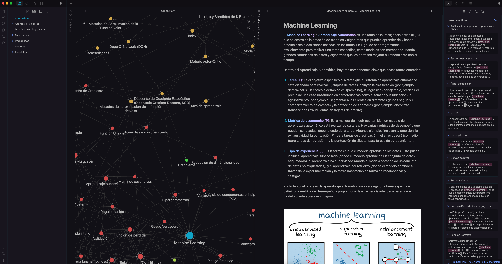

# Repositorio del Postgrado en Inteligencia Artificial

¡Bienvenido a mi repositorio de notas sobre el Postgrado en Inteligencia Artificial! Aquí encontrarás notas exhaustivas y detalladas sobre varios temas relacionados con la inteligencia artificial, incluyendo Agentes Inteligentes, Machine Learning y más.

## Cómo usar este repositorio

Para la mejor experiencia, te recomendamos que abras este repositorio con [Obsidian](https://obsidian.md). Obsidian es una poderosa aplicación de toma de notas y gestión del conocimiento que utiliza una estructura de archivos locales y enlaces tipo wiki. Esta estructura permite una interconexión flexible y rica de tus notas, lo que facilita la creación de una "segunda mente" digital.

Para descargar Obsidian, puedes seguir este [enlace](https://obsidian.md/download).

Para abrir el repositorio con Obsidian, sigue estos pasos:

1. Clona este repositorio en tu máquina local.
2. Abre Obsidian.
3. Haz clic en `Abrir`, luego selecciona la carpeta de este repositorio.

## Colaboraciones

¡Las colaboraciones son muy bienvenidas! Si tienes algún aporte o mejora que quieras compartir, no dudes en abrir un Pull Request. Nos encantaría ver tus contribuciones y discutirlas con la comunidad.

## Generado con IA

La mayoría de las notas en este repositorio fueron generadas con ayuda de la inteligencia artificial, específicamente con ChatGPT-4 de OpenAI. Si bien hemos hecho todo lo posible para verificar la precisión de las notas, siempre existe la posibilidad de errores. Si encuentras algún error, por favor abre un Issue para que podamos corregirlo lo más pronto posible.

## Licencia

Este proyecto está bajo la licencia MIT.
